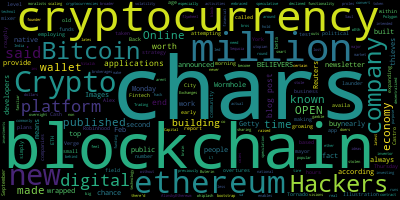
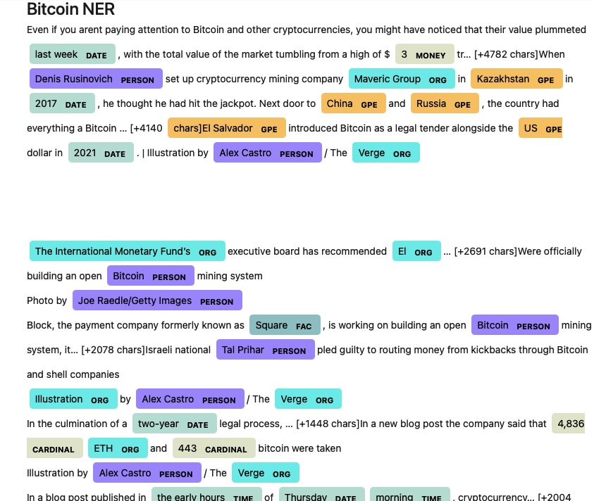
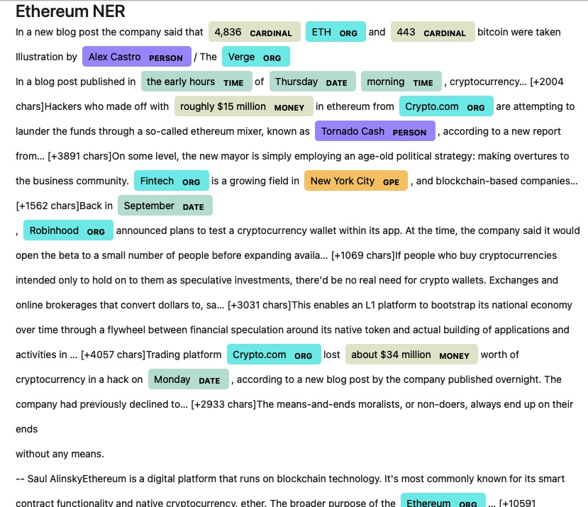

# Unit 12—Tales from the Crypto

## Background of Assignment
 
There's been a lot of hype in the news lately about cryptocurrency, so you want to take stock, so to speak, of the latest news headlines regarding Bitcoin and Ethereum to get a better feel for the current public sentiment around each coin.

In this assignment, you will apply natural language processing to understand the sentiment in the latest news articles featuring Bitcoin and Ethereum. You will also apply fundamental NLP techniques to better understand the other factors involved with the coin prices such as common words and phrases and organizations and entities mentioned in the articles.

Complete the following tasks:

1. [Sentiment Analysis](#1---Sentiment-Analysis)
2. [Natural Language Processing](#2---Natural-Language-Processing)
3. [Named Entity Recognition](#3---Named-Entity-Recognition)

---

## Files

[Starter Notebook](Starter_Code/crypto_sentiment.ipynb)

---

## Key Observations

### 1 - Sentiment Analysis

I used the [newsapi](https://newsapi.org/) to pull the latest news articles for Bitcoin and Ethereum and create a DataFrame of sentiment scores for each coin.

Summary of  descriptive statistics :

> Q: Which coin had the highest mean positive score?

> A: Bitcoin has a slightly higher mean positive score of 0.0569 compared to Ethereum which has a mean positive score of 0.0532

> Q: Which coin had the highest compound score?

> A: Both, the bitcoin and etherum had the same highest compound score of 0.68

> Q. Which coin had the highest positive score?

> A: Both, the bitcoin and etherum had the same highest positive score of 0.185

### 2 - Natural Language Processing

In this section, I used NLTK and Python to tokenize text, find n-gram counts, and create word clouds for both coins. 

#### Top 10 words for Bitcoin using token_count

> ('bitcoin', 16),
> ('company', 7),
> ('mining', 6),
> ('ha', 5),
> ('open', 5),
> ('cryptocurrency', 4),
> ('building', 4),
> ('new', 4),
> ('last', 3),
> ('salvador', 3)

#### Top 10 words for Ethereum using token_count

> ('cryptocurrency', 7),
> ('ethereum', 7),
> ('new', 6),
> ('company', 5),
> ('million', 5),
> ('platform', 4),
> ('digital', 4),
> ('blockchains', 4),
> ('blog', 3),
> ('post', 3)]

#### Word Clouds

Below were the key observations basis word clouds.

### 3 - Named Entity Recognition

In this section, I built a named entity recognition model for both coins and visualized the tags using SpaCy.

#### Bit Coin NER

#### Ethereum NER

### Resources

[Vader Sentiment Analysis](http://www.nltk.org/howto/sentiment.html)

